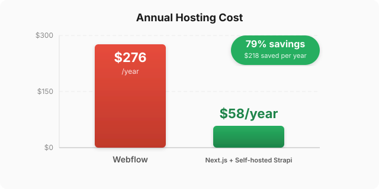

# SBMPP Website Migration

Migrating a Polish housing cooperative's website from Webflow to self-hosted Next.js — cutting annual costs by 79%.

   

   
  <em>Hosting cost after migration</em>

## The Problem

[SBMPP](https://www.sbmpp.lublin.pl) is a small housing cooperative in Lublin, Poland. Their website is hosted on Webflow at **$23/month ($276/year)** — a platform built for design agencies and SaaS marketing sites. The actual usage? Five document updates in two months. Webflow is overkill for what is essentially a digital noticeboard with downloadable PDFs.

## The Solution

A pixel-perfect migration to **Next.js 15** with static site generation, deployable on a **~$5/month VPS**. Content management moves to a self-hosted **Strapi CMS** on the same server, giving staff a familiar editing interface without the Webflow price tag.

| | Webflow | Self-hosted |
|---|---|---|
| **Annual cost** | $276 | ~$58 |
| **CMS** | Webflow Designer | Strapi (self-hosted) |
| **Hosting** | Webflow CDN | VPS + Caddy |
| **Savings** | — | **79%** |

## Tech Stack

- **Next.js 15** — App Router, static generation, image optimization
- **React 18 + TypeScript** — type-safe components
- **CSS Modules** — scoped styling, no runtime overhead
- **Strapi** — headless CMS for content management (planned)
- **Sharp** — server-side image optimization

## Migration Approach

1. **Mirror** — `wget` the live Webflow site to capture all HTML, assets, and structure
2. **Convert** — Rebuild each page as Next.js components with structured TypeScript data files
3. **CMS** — Connect Strapi for staff-managed content (documents, announcements, tenders)

## Current Status

**Done:**
- All 8 pages converted (home, history, contact, announcements, tenders, documents, org chart, member portal)
- Structured content in TypeScript data files (20 buildings, 16 documents, announcements, tenders)
- Contact form with server-side validation
- Dynamic routes for announcements (`/ogloszenia/[slug]`)
- SEO: JSON-LD schemas, XML sitemap, Open Graph metadata
- Responsive navigation, modal/lightbox/toast UI components
- Hero video background with MP4/WebM sources

**Next:**
- Strapi CMS integration
- Deployment to VPS
- Contact form email backend

## Live Site

Current Webflow version: [sbmpp.lublin.pl](https://www.sbmpp.lublin.pl)
